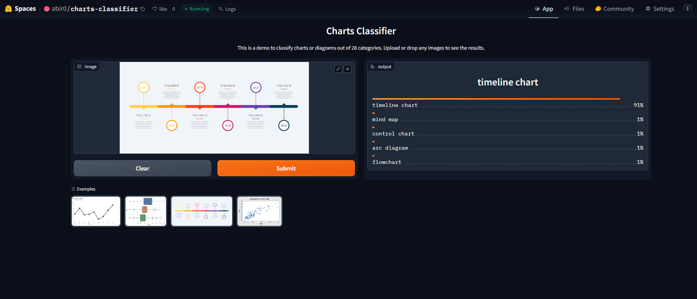

# Charts-Classifier
An image classification model from data collection, cleaning, model training, deployment and API integration.  

    

  
Table of Contents

  <ol>
    <li><a href="#model-overview">Model Overview</a></li>
    <li><a href="#dataset-preparation">Dataset Preparation</a></li>
    <li><a href="#training-and-data-cleaning">Training and Data Cleaning</a></li>
    <li><a href="#model-inference">Model Inference</a></li>
    <li><a href="#model-deployment">Model Deployment</a></li>
  </ol>

 

## Model Overview

The model can classify 28 different types of charts and diagrams  

The types are following:  

1. arc diagram
2. area chart
3. bar chart
4. block diagram
5. boxplot
6. bubble chart
7. cartogram
8. control chart
9. dendrogram
10. flowchart
11. funnel chart
12. gantt chart
13. heatmap
14. histogram
15. line graph
16. matrix diagram
17. mind map
18. network graph
19. neural network diagram
20. organogram
21. phase diagram
22. pie chart
23. radar chart
24. scatter plot
25. snakey chart
26. surface plot
27. timeline chart
28. venn diagram

## Dataset Preparation

**Data Collection:** Downloaded from DuckDuckGo using term name  
**DataLoader:** Used fastai DataBlock API to set up the DataLoader.  
**Data Augmentation:** fastai provides default data augmentation which operates in GPU.  

Details can be found in `notebooks/data_collection_and_augmentation.ipynb`

## Training and Data Cleaning

**Training:** Fine-tuned a resnet34 model for 6 epochs (2 times) and got upto ~85% accuracy.  
**Data Cleaning:** Since the data was collected from DuckDuckGo search engine API, there were many noises and inconsistencies within the dataset. Hence, the data was cleaned and updated using the fastai ImageClassifierCleaner. The data was cleaned each time after training or finetuning until the final iteration of the model.  

Details can be found in `notebooks/model_training_and_cleaning.ipynb`

## Model Inference

The model was exported as a `.pkl` file and was used for inference.

Details can be found in `notebooks/model_inference.ipynb`

## Model Deployment

The model was deployed to HuggingFace Spaces as a Gradio App. The implementation can be found [here](https://huggingface.co/spaces/abir0/charts-classifier).  

## API integration with GitHub Pages

The deployed model API is integrated [here](https://abir0.github.io/Charts-Classifier/) in GitHub Pages Website. Implementation and other details can be found in `docs` folder.
